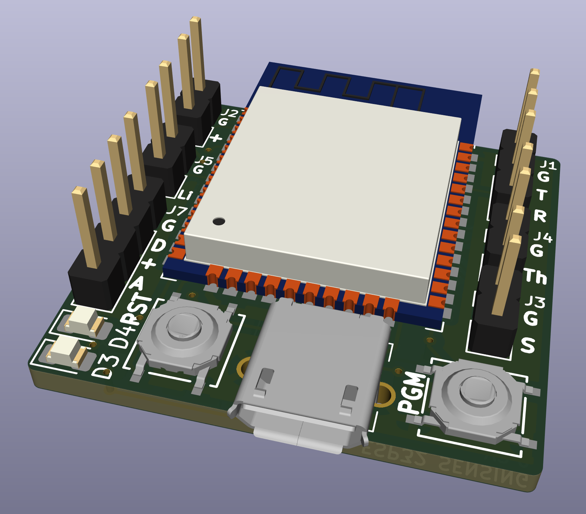
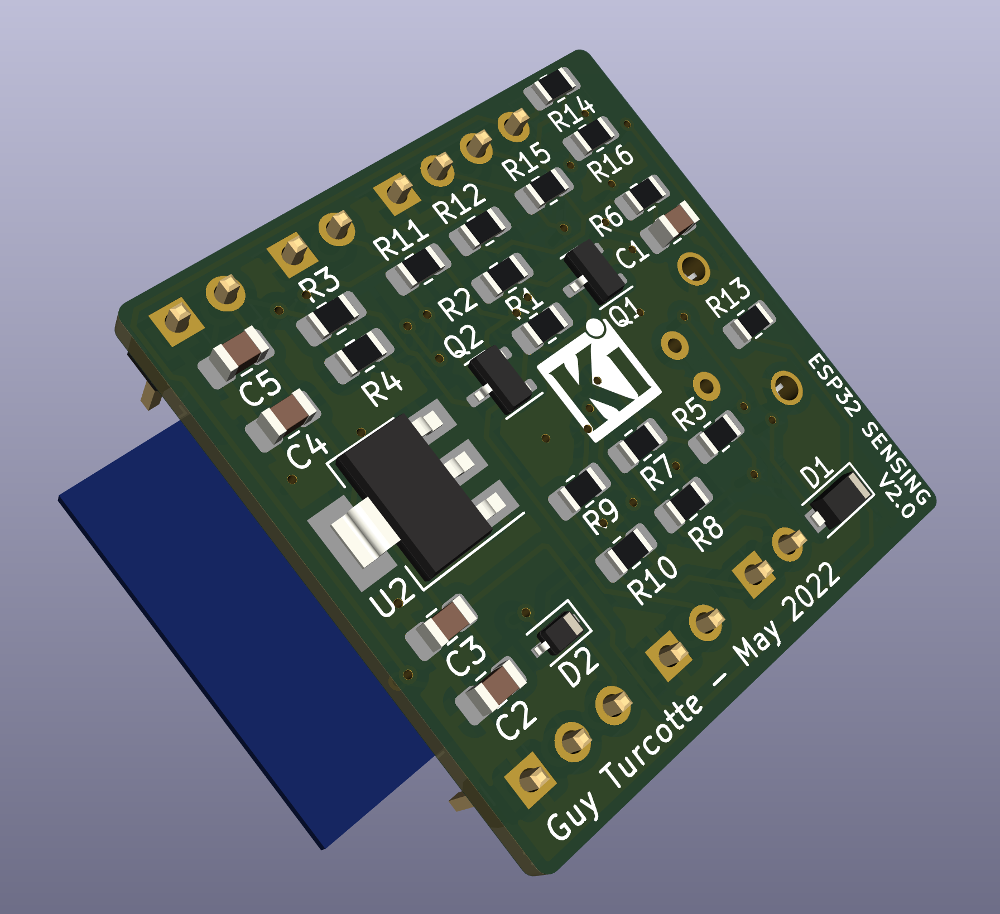
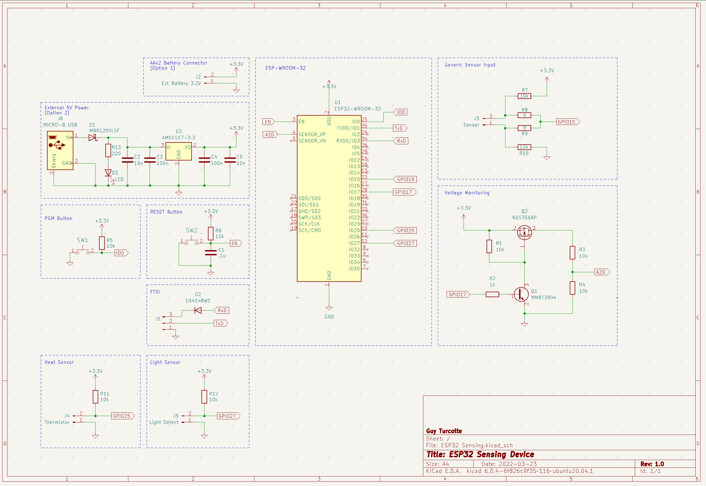

# ESP32 Sensing device V1.0

(Updated March 23, 2022)

(The documentation remains to be completed)

This is a small footprint ESP32-based sensing device, with the following characteristics:

- 30x28 mm circuit board (30x40 mm with ESP32 antenna)
- Two power modes:
    - Battery (AAx2) (through external battery case)
    - External 5 Volts power support (through power only Micro USB-B port)
- Battery level monitoring circuit
- Three Sensing ports:
    - Multi-Purpose (configurable through Resistor and Capacitor parts)
    - Thermistor (https://learn.adafruit.com/thermistor/using-a-thermistor)
    - Photoresistor (https://learn.adafruit.com/photocells/using-a-photocell)
- External FTDI port (through a 3-pins [GND, RxD, TxD] port) (https://learn.adafruit.com/ftdi-friend)
- RST / PGM buttons
- Power LED (for external power only)
- Designed with KiCAD V6.0.4 (https://www.kicad.org)
- Public Domain

&nbsp;&nbsp;&nbsp;&nbsp;

The choice of components is related to their availability in my inventory. 

## Design Description

Looking at the schematic, you will find here the information related to each subsection present on the device. Some subsections are required, others are optional depending on your needs.

The electronic component identifiers required for each subsection are listed inside square brackets.

### Required Subsections

- **ESP-WROOM-32** [**U1**] - This is the processor in use on the device.
- **RESET Button** [**SW2**, **R6**, **C1**] - Required to maintain the processor working and do a reset when it is required to take back the control for programming or when the device is not behaving properly.
- **PGM Button** [**SW1**, **R5**] - For programming the processor, the PGM Button must be pressed as the reset button is also pressed such that the processor will be put in program loading. The FTDI interface must be connected to the computer to transmit the new program.
- **FTDI** [**D2**, **J1**] - This is the connection to an external FTDI device that allows for communication between the ESP32 processor and a development PC.

### Optional Subsections

- **AAx2 Battery Connector** [**J2**] - If power is to be supplied with AA batteries, the connector is required. The batteries holder wires can also be directly soldered in the through-holes. Please respect the polarity (a '+' sign is present on the board to indicate the positive wire location). **Do not connect any battery if you intend to use an external power supply.**
- **External 5V Power**, [**U2**, **J6**, **D1**, **D3**, **R13**, **C2**, **C3**, **C4**, **C5**] - This is a linear 3.3V regulator circuit, only required when a DC 5 Volts power supply is used. It is expected that the power supply is using a male micro USB-B connector. **Do not implement this subsection if you intend to use batteries.**
- **Voltage Monitoring** [**Q1**, **Q2**, **R1**, **R2**, **R3**, **R4**] - This circuit will allow for reading the 3.3 V power voltage for the device through ADC1_0 internal to the ESP32. If AA batteries are used, it will allow monitoring the battery level to replace them when required. The MOSFET transistor [**Q2**] insure that the circuit will not take a load on the batteries. Must be enabled through [**Q1**] using GPIO17.
- **Generic Sensor Input** [**J3**, **R7**, **R8**, **R9**, **R10**] - This is a port to retrieve some sensor information. The four resistors must be adjusted to consider the kind of sensing to be done (pull-up, pull-down, etc.). Some resistors locations can be used for capacitors if required (e.g. adding an RC circuit). This sensor is connected to GPIO15 (ADC2_3) of the ESP32.
- **Heat Sensor** [**J4**, **R11**] - Allow for reading the level of Heat using an external thermistor through an A2D of the processor. This sensor is connected to GPIO25 (ADC2_8) of the ESP32. Can be used with another kind of sensor as appropriate.
- **Light Sensor** [**J5**, **R12**] - Allow for reading the level of Heat using an external photoresistor through an A2D of the processor. This sensor is connected to GPIO27 (ADC2_7) of the ESP32. Can be used with another kind of sensor as appropriate.

### Bill of Material (BOM)

(To be added)

## Copyright (c) 2022 Guy Turcotte

Permission is hereby granted, free of charge, to any person obtaining a copy of this project and associated documentation files (the "Project Content"), to deal in the Project without restriction, including without limitation the rights to use, copy, modify, merge, publish, distribute, sublicense, and/or sell copies of the Project Content, and to permit persons to whom the Project Content is furnished to do so, subject to the following conditions:

The above copyright notice and this permission notice shall be included in all copies or substantial portions of the Project Content.

THE PROJECT CONTENT IS PROVIDED "AS IS", WITHOUT WARRANTY OF ANY KIND, EXPRESS OR IMPLIED, INCLUDING BUT NOT LIMITED TO THE WARRANTIES OF MERCHANTABILITY, FITNESS FOR A PARTICULAR PURPOSE, AND NON-INFRINGEMENT. IN NO EVENT SHALL THE AUTHORS OR COPYRIGHT HOLDERS BE LIABLE FOR ANY CLAIM, DAMAGES, OR OTHER LIABILITY, WHETHER IN AN ACTION OF CONTRACT, TORT OR OTHERWISE, ARISING FROM, OUT OF OR IN CONNECTION WITH THE PROJECT CONTENT OR THE USE OR OTHER DEALINGS IN THE PROJECT CONTENT.