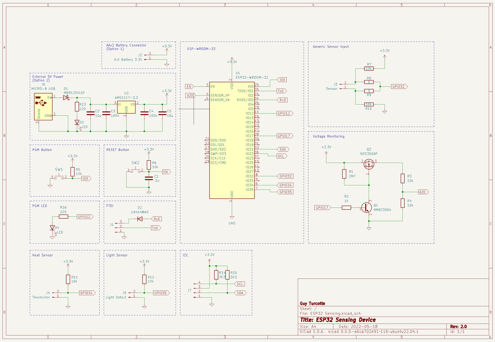

# ESP32 Sensing device

(The documentation remains to be completed)

This is a small footprint ESP32-based sensing device, with the following characteristics:

- 30x28 mm circuit board (30x40 mm with ESP32 antenna)
- Two power modes:
    - Battery (AAx2) (through external battery case)
    - External 5 Volts power support (through power only Micro USB-B port)
- Battery level monitoring circuit
- Three Sensing ports:
    - Multi-Purpose (configurable through Resistance and Capacitor parts)
    - Thermistor (https://learn.adafruit.com/thermistor/using-a-thermistor)
    - Photoresistor (https://learn.adafruit.com/photocells/using-a-photocell)
- External FTDI port (through a 3-pins [GND, RxD, TxD] port) (https://learn.adafruit.com/ftdi-friend)
- RST / PGM buttons
- Power LED (for external power only)
- Designed with KiCAD V6.0.4 (https://www.kicad.org)
- Public Domain

&nbsp;&nbsp;&nbsp;&nbsp;

The choice of components is related to their availability in my inventory. 

## Copyright (c) 2022 Guy Turcotte

Permission is hereby granted, free of charge, to any person obtaining a copy of this project and associated documentation files (the "Project Content"), to deal in the Project without restriction, including without limitation the rights to use, copy, modify, merge, publish, distribute, sublicense, and/or sell copies of the Project Content, and to permit persons to whom the Project Content is furnished to do so, subject to the following conditions:

The above copyright notice and this permission notice shall be included in all copies or substantial portions of the Project Content.

THE PROJECT CONTENT IS PROVIDED "AS IS", WITHOUT WARRANTY OF ANY KIND, EXPRESS OR IMPLIED, INCLUDING BUT NOT LIMITED TO THE WARRANTIES OF MERCHANTABILITY, FITNESS FOR A PARTICULAR PURPOSE, AND NON-INFRINGEMENT. IN NO EVENT SHALL THE AUTHORS OR COPYRIGHT HOLDERS BE LIABLE FOR ANY CLAIM, DAMAGES, OR OTHER LIABILITY, WHETHER IN AN ACTION OF CONTRACT, TORT OR OTHERWISE, ARISING FROM, OUT OF OR IN CONNECTION WITH THE PROJECT CONTENT OR THE USE OR OTHER DEALINGS IN THE PROJECT CONTENT.